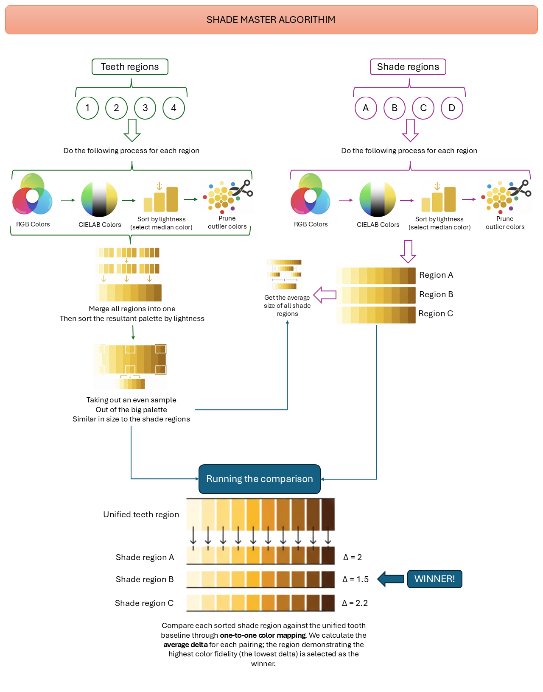

# Shade Master

Android flutter application to help dentist pick shades from a shade guide.

## How to use it

You need to take a photo with your phone that shows both the teeth and the shades approximate to each other, under the same lighting conditions, and as much as possible without glare.

Then using the application you should select the teeth, and select the shades, the application would tell you which shade is closest.

DEMO:

## Technical info

The following graph explains it all:

## License MIT
